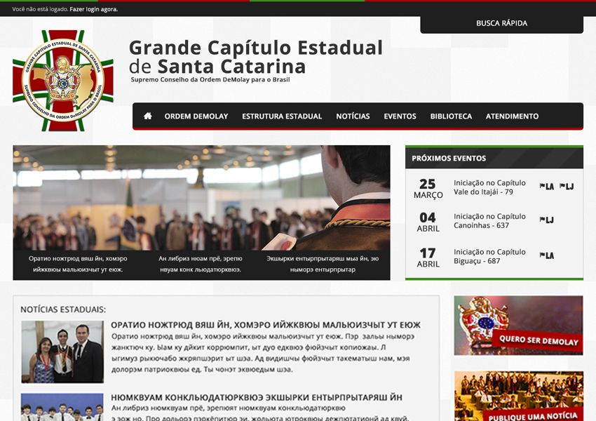

# **Site Wordpress - DeMolay Santa Catarina - 2015**

## **Overview**
A proposta do projeto foi feita a construção do layout e desenvolvimento dos respectivo portal que tinha como requisito principal servir informações, notícias, calendários e comunicados inerentes a instituição. O projeto possuía também uma área de acesso restrito a membros que permitia o download documentos oficiais e materiais diversos.

- **Versão:** Esse projeto está **descontinuado**, não aceitando mais modificaçãoes.
- **Elaboração:** 2016  
- **Licença:** Proprietária - Uso Privado 

Todos os direitos reservados - A cópia não autorizada de qualquer arquivo deste projeto, por qualquer meio, é estritamente proibida.  

 

## **Usando**  
Para facilitar a utilização e iniciação do projeto foi crado o arquivo python `projetct.py`. Através dele é possível inciar, popular e interromper o projeto.

- Install - `py project.py install`
- Import - `py project.py idata`
- Export - `py project.py edata`
- Uninstall - `py project.py uninstall`

Outros comando podem ser fornecidos: `py project.py --help`
Acesso ao container wp-cli - `docker-compose run --rm cli sh`
Acesso ao container wordpress - `docker-compose exec wordpress bash`

 

## **Screenshot**

